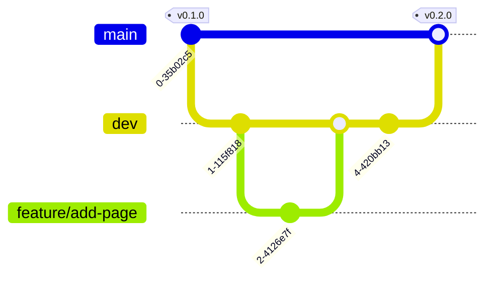

# Contributing

Thank you for contributing! This guide explains the branching model, the commit
message format, and the pull-request rules. It assumes no prior experience with
this workflow — if a term is new to you, the walkthrough below spells out every
step.

## Branching model

This repo uses a simple two-branch model with short-lived working branches.

### The branches

- **`main` — stable release branch.** Always in a released, buildable state:
  every commit on `main` corresponds to a released (or release-ready) version.
  Protected — no direct pushes. `main` is the repo's **default branch**, so it
  is what visitors see first.
  > **Why `main` is the default:** newcomers should land on, and start from, the
  > stable state — not work-in-progress.
- **`dev` — integration branch.** Where reviewed changes accumulate between
  releases. Protected — changes arrive only via pull request (PR). Work in
  progress is expected here; a known-broken state is not, because module IGs
  vendor `dev` itself while the template package is unpublished — see
  [how a module consumes this template](docs/workflows.md#how-a-module-consumes-this-template).
- **`feature/*`, `change/*`, `fix/*` — short-lived working branches.** Branched
  **off `dev`**, one focused change each, merged back into `dev` via PR, then
  deleted. Name them descriptively, e.g. `feature/add-terminology-page` or
  `fix/footer-contrast`.
  > **Why short-lived and off `dev`:** long-running branches diverge and become
  > painful to merge; small branches keep review cheap and history legible.

### The flow, step by step

1. Update your local `dev`: `git checkout dev && git pull`.
2. Create a working branch off `dev`:
   `git checkout -b feature/<topic>` (or `change/<topic>`, `fix/<topic>`).
3. Make your change. Commit using Conventional Commits (cheat-sheet below).
4. Push the branch and open a PR **targeting `dev`**.
5. On green CI and review approval, the PR is **squash-merged** into `dev` and
   the working branch is deleted.
   > **Why squash into `dev`:** a squash collapses the branch's work-in-progress
   > commits into ONE clean Conventional Commit on `dev`. Each entry in `dev`'s
   > history then equals one reviewed change — which is exactly the granularity
   > the changelog is later built from.
6. To release: a maintainer opens a **`dev` → `main` PR** (the release-candidate
   gate — a human decision, not automated). That PR is merged as a **merge
   commit, not a squash**.
   > **Why the `dev` → `main` merge is a merge commit and not a squash:** the
   > release automation on `main` reads the individual Conventional Commits to
   > build an accurate changelog and pick the next version. Squashing `dev` →
   > `main` would collapse all accumulated changes into one commit, and the
   > changelog would collapse to a single line. The merge commit preserves every
   > commit that was squashed into `dev`, so nothing is lost.

### Diagram



> Reads as: work happens on short-lived `feature/*` off `dev`; `dev` integrates;
> `dev → main` is the release, tagged by Release Please on `main`.

## Conventional Commits — cheat-sheet

Every commit message (and every PR title, since PRs are squash-merged) follows
the [Conventional Commits](https://www.conventionalcommits.org/en/v1.0.0/)
format:

```
<type>: <short description in the imperative>
```

| Type | Use it when you… | Example |
| --- | --- | --- |
| `feat` | add functionality (a new template feature, include, style) | `feat: add MII footer include` |
| `fix` | repair something broken | `fix: correct footer contrast on dark background` |
| `docs` | change documentation only | `docs: explain template versioning` |
| `chore` | do housekeeping (configs, licenses, .gitignore) | `chore: scaffold repository` |
| `ci` | change CI workflows | `ci: pin actions to commit SHAs` |
| `refactor` | restructure without changing behavior | `refactor: split header include` |
| `test` | add or fix tests/checks only | `test: add template build smoke check` |

Extras a novice should know:

- **Scope (optional):** `feat(includes): …` narrows where the change happened.
- **Breaking change:** add `!` after the type — `feat!: …` — and explain the
  break in the commit body. This triggers a MAJOR version bump.
- Keep the description under ~72 characters, imperative mood ("add", not
  "added"), no trailing period.

> **Why this format is mandatory:** the release automation derives the next
> SemVer version and the changelog *from the commit types* (`fix` → PATCH,
> `feat` → MINOR, `!` → MAJOR). A mistyped commit means a wrong version number.

## Pull-request rules

- **Small and single-purpose.** One logical change per PR. If you can describe
  the PR only with "and", split it.
- **Target `dev`** (never `main` — except the release PR opened by a
  maintainer).
- **Title** = a Conventional Commit line (it becomes the squash commit on
  `dev`).
- **Body** uses this format:

  ```
  ## Summary
  <what this PR adds/changes, bullet list>

  ## Rationale
  <why — reference the relevant docs/spec; call out non-obvious choices>

  ## How to verify
  <numbered, copy-pasteable steps a reviewer can run>
  ```

- CI must be green and review approval given before merge.
- Delete the working branch after the merge.

## Release automation

Release automation (Release Please, producing SemVer `vMAJOR.MINOR.PATCH` tags,
a generated `CHANGELOG.md`, and a GitHub Release) runs **on `main`** — it will
be added to this repository by a later PR. Until then, releases are manual.

> **Why SemVer for this repo:** this is a *tooling* repo whose consumers (the
> MII KDS module IGs) pin to a version; SemVer communicates breaking vs.
> compatible changes. Do not confuse it with the CalVer (`YYYY.n.n`) scheme the
> MII KDS *modules* use for their own releases — one repo, one release
> mechanism.
